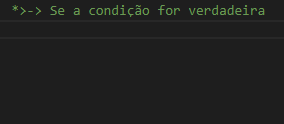
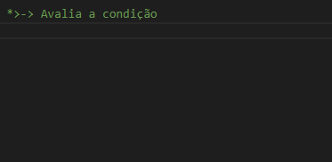

# Rech Informática extension for editing Cobol files with Visual Studio Code.

## IntelliSense for variable declaration
The variable declaration is done in two steps so that the editor parses the picture and generates the most approprivate VALUE in the VALUE clause:

* If it's a numeric display variable (picture contains **.**, **z**, **b**, **-** or **,**) inserts **VALUE IS ZEROS**.

* If it's a numeric variable for computing, with decimal **v** or negative **s**, inserts **VALUE IS ZEROS COMP**.

* If it's an alphanumeric variable inserts **VALUE IS SPACES**.

* If it's a  variable for computing, without decimal **v** nor negative **s**, inserts **VALUE IS ZEROS COMP-X**.

## Formatter and loop completion
The Language Server provides automatic formatting for several Cobol clauses as shown below:

## Peek definition
You can peek Cobol variable and paragraph definitions!

## Code highlight

## Paragraph suggestion
